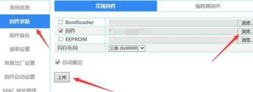
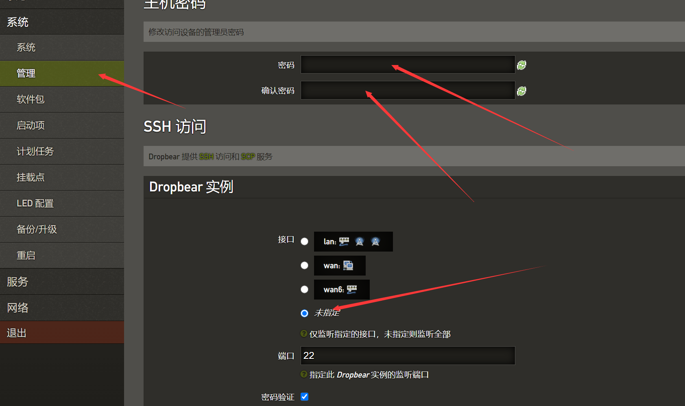
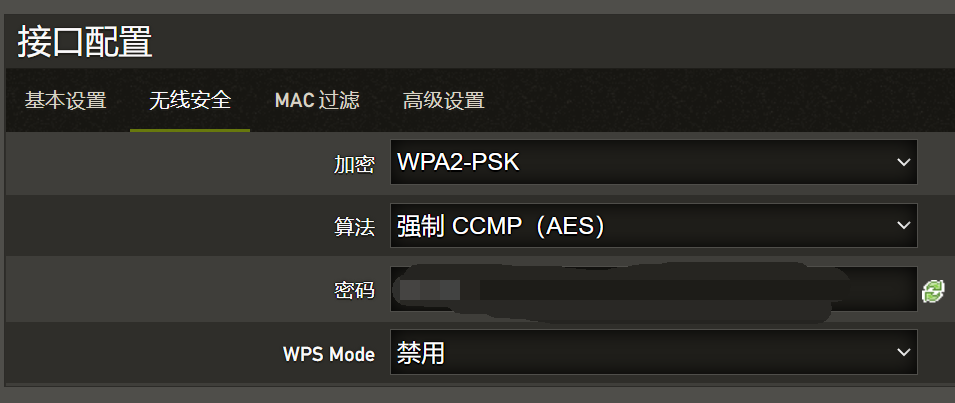
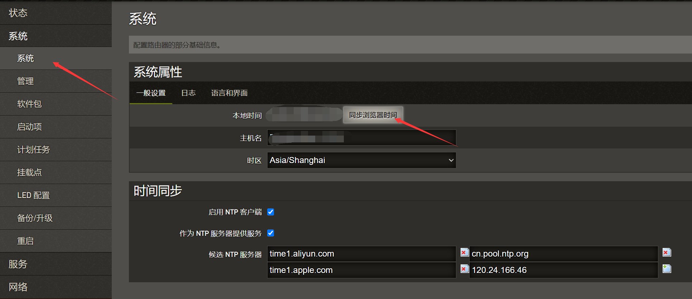
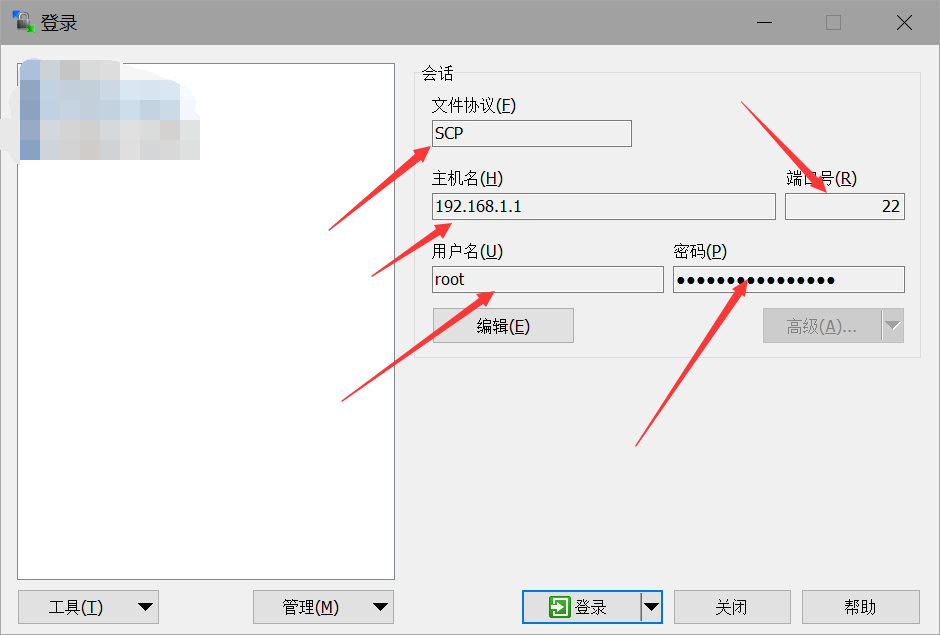
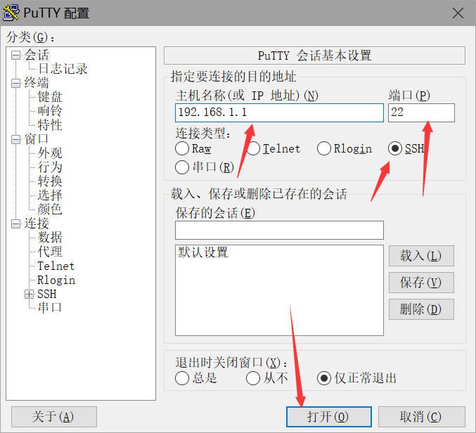
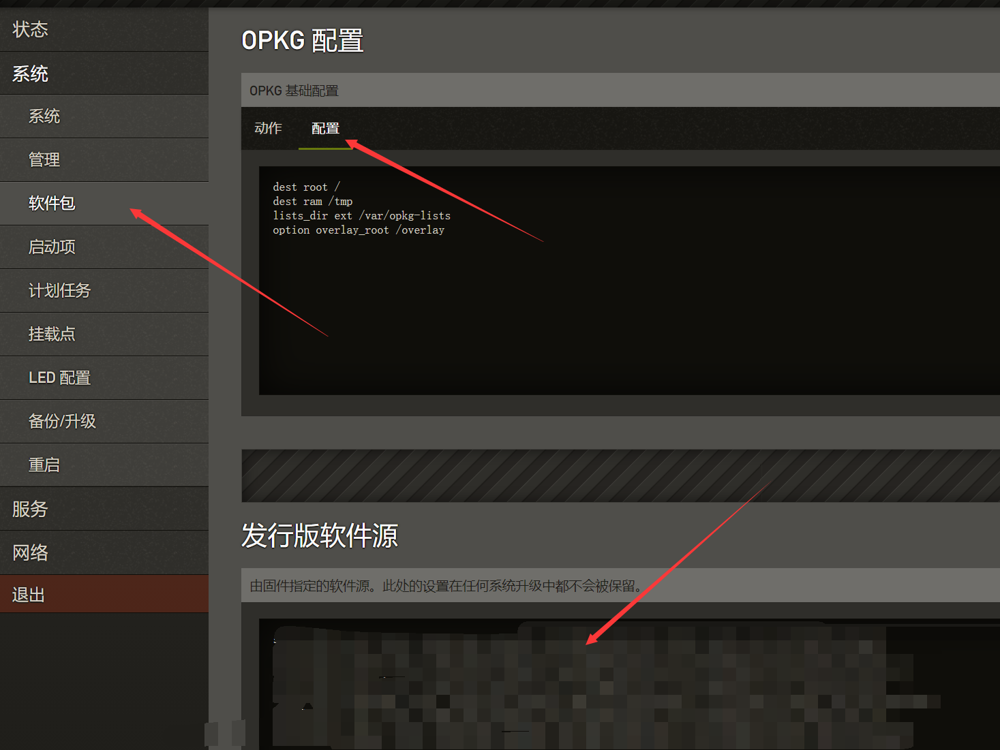
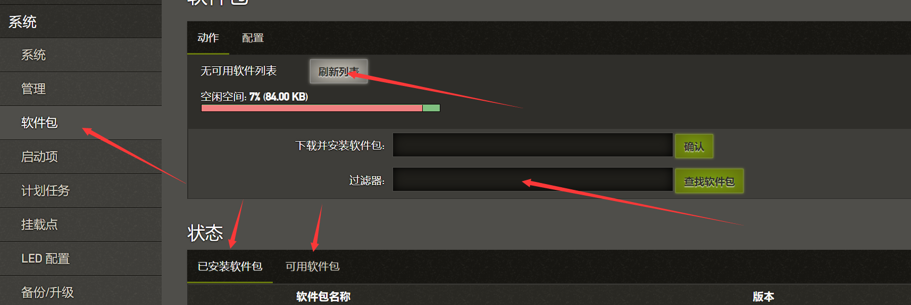

#  以k2和k2p为例展示netkeeper校园拦截拨号
------
## 点点右上角Star支持一下呗！！！
------
> * 破解校园网络实现一个账号通过路由器共享网络
> * 高校 校园网 重庆 创翼 netkeeper PPPOE拦截
> * 已测试支持版本NetKeeper_pppoe_5.2.22.5226
> * 本文所展示的操作适用于所有的openwrt和PandoraBox，拦截netkeeper真实网号后，再用路由器进行拨号
> * 非本文所使用的固件请自行下载对应ipk	
> * [原理：pppoe服务器拦截账号法](https://github.com/miao1007/Openwrt-NetKeeper/blob/master/netkeeper4-use-pppoer-server/README.md) 

`注意：路由器特指装有openwrt或潘多拉的路由器。`	
`请将所有文件下载，解压到同一文件夹中`  
### 零 刷写固件：	
	如果是没有刷过机的路由器，请参考网上的相关资料刷机
	先刷不死 非必须步骤：		
[刷Breed参考](https://www.right.com.cn/forum/thread-3157298-1-1.html)
		
	注意1：K2_V22.6.529.XXX K2P_V10.3.XX.XX版本是无法刷入的。会提示连接telnet失败
		再刷解压出来文件中的对应固件。
> * 按以下操作写入固件

		1.拔除电源
		2.长按复位键并插入电源，大约15秒
		3.在浏览器地址栏输入 192.168.1.1进入刷机界面
		4.选择刷入对应固件，布局：公版(只针对本文固件，其他固件请按实际选择)，立即更新
		5.自动重启，此时这个路由器就是一个正常的OPENWRT或潘多拉路由器

### 一 初始设置路由器：
> * 一开始WAN口不要插网线

		1.地址栏输入：192.168.1.1进入路由器管理界面，本固件默认密码是admin
			其他固件可能是 password admin root
		2.修改密码：进入管理界面后找到 系统->管理(权)->修改合适的密码
		3.修改WiFi：网络->无线->修改->设置ssid和无线安全中的加密方式 算法和密码 
			加密方式选择 WPA2-PSK 算法选择AES
		4.选择设置你需要的功能：硬件加速等等
		5.同步时间：包括电脑和路由器的时间都要设置为标准的北京时间 系统->系统 同步时间

### 二 进入正题：
		1.进入文件夹 WinSCP 打开 WinSCP.exe 
			文件协议SCP 地址填 192.168.1.1 
			用户名 root 密码 你自己设置的路由器管理密码
			文件框的右边才是你路由器的文件夹！！！

		2.把netkeeper4-use-pppoer-server文件夹中的3个文件,nk4 nk4.sh nk4conf.sh
			拖动到root文件夹中(理论上讲，此时root文件夹中没有其他文件，请对照)
			在路由器root文件夹中同时选中这三个文件nk4 nk4.sh nk4conf.sh 
			右击->属性 在八进制栏修改为 7777
			确定

		3.把存放固件文件夹中的2个文件rp-pppoe-common**********.ipk
			和rp-pppoe-server**********.ipk
			(这两个文件一定要对应选取，比如K2的一定要选择K2的)拖动到tmp文件夹中
			(tmp文件夹中有许多文件)
		4.进入解压文件夹putty->打开putty.exe->地址192.168.1.1->确定
			输入用户名root 密码(不可见)

		5.安装拦截软件->依次运行以下代码:
			cd /tmp
			opkg install rp-common***.ipk
			opkg install rp-server***.ipk
			请注意：rp-common***.ipk和rp-server***.ipk一定要写完整
			报错不用理，除非显示安装不了这两个ipk
		6.运行拦截脚本：
			sh /root/nk4conf.sh
			报错不用理，可能会重启
		7.等待。直到浏览器可以进入 192.168.1.1 这个管理界面
		8.查看 网络->接口 WAN下方是不是改为了PPPOE拨号
		9.WAN口插入网线
		10.电脑用你的netkeeper拨号软件正常拨号(账号密码一定要正确)
			提示691后基本成功，一般1-5s后会有网
			你还可以查看 路由器管理界面 网络->接口->WAN 
			看一般配置的 用户名和密码(用户名是 乱码+正常的账号 密码是正确的密码)
> * 注意：有一天不能上网了你可以这样做：

		方案1 拔插路由器电源
		方案2 重新执行 二 进入正题的第6步操作
		方案3 重新执行 二 进入正题
		方案4 重新完全设置一遍路由器
		方案5 睡觉
### 三 本方案最适合：
> * 全天不断电不断网用户。路由器重启、晚上12点断网可能需要重新用电脑拨号
> * 本方案已经测试过多个版本的openwrt版本 发现最稳定的还是潘多拉
### 四 高级操作（账号叠加 多播？）：
> * 适合有多个账号和一个账号能同时登陆多台电脑的用户

		讲诉比较简单，但关键步骤不会少
		1.系统->软件包->配置->发行版软件源 请对应路由器型号修改 源在固件文件夹中
		2.动作->刷新列表 等待提示成功 若失败请再试试
		3.过滤器中依次搜索安装 没有安装的插件 具体可以查看 多播安装顺序 
		一定要按顺序 顺序如下：
			已经安装的就不用覆盖安装了
			依次安装：
			kmod-ipt-conntrack-extra
			iptables-mod-conntrack-extra
			kmod-ipt-ipopt
			iptables-mod-ipopt
			mwan3
			luci-app-mwan3
			luci-i18n-mwan3-zh-cn
			luci-app-syncdial
			选装：
			luci-app-mwan3helper
			luci-i18n-mwan3helper-zh-cn
		4.安装完毕后，网络 会出现虚拟WAN和负载均衡 我们要的就是虚拟WAN
		

		
### 五 多播关键操作：
		1.确保以上插件安装完毕后 拔出WAN口网线
		2.拨号
		3.网络->接口->WAN 
			复制一般配置的 用户名 到文本中存起来等会用
		4.有几个账号就重复2 3几次
		5.网络->虚拟WAN 选择个数 和账号数一样
			绑定物理接口(如果有)
			检测数量和账号数一致(如果有)
			启用
		6.你会发现 网络->接口 中出现了几个 MWAN
			依次手动填入 你获取的账号 和 密码
			必须做的事情：同时你还需要做
				基本设置 旁边 高级设置->使用网关跃点
				改为不一样的整数
				比如 MWAN1 40
				     MWAN2 41
				     等等
			不然多播不稳定
		7.确定设置正确后，多检查几次
			WAN插上网线 enjoy
> * 请注意，根据测试发现在获取的账号中 有符号 : 的话容易多播失败
### 六 高级操作只适合：
> * 全天不断网不断电的用户
> * 由于高校寝室网络单口一般 100mbps
> * 请根据实际需求使用

	注意：断网了怎么办？
		1.网络->虚拟WAN 
			不启用
		2.尝试单网号上网 
			上网失败：
				方案1 拔插路由器电源
				方案2 重新执行 二 进入正题的第6步操作
				方案3 重新执行 二 进入正题
				方案4 重新完全设置一遍路由器
				方案5 睡觉
			成功：进入3
		3.使用 多播关键操作
> * 这就是为什么不推荐使用这种方案多播的原因
## [本文参考](https://www.bilibili.com/read/cv7913375/)

## 点点右上角Star支持一下呗！！！

有机会写写最简单的网页认证破解：
	要求：一号两机 也就是一手机 一电脑。 
	学校使用无感知。 
	做到什么地步？ 
	叠加到自闭。达到水桶效应、 网号上限 、多播上限
	
[点击链接加我为QQ好友](https://qm.qq.com/cgi-bin/qm/qr?k=CkOkAr8EULrKeCTefV3sK9xhz8lL8QHK&noverify=0)    
2020 年 12月 05日 
